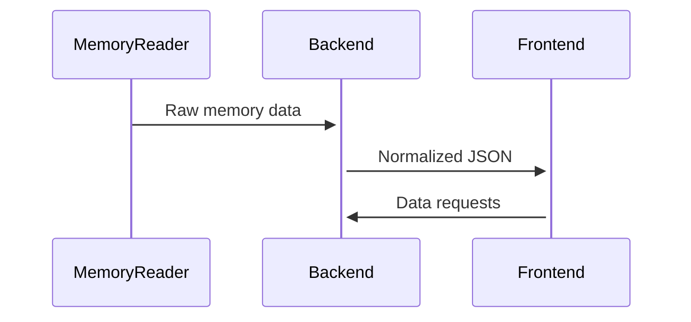
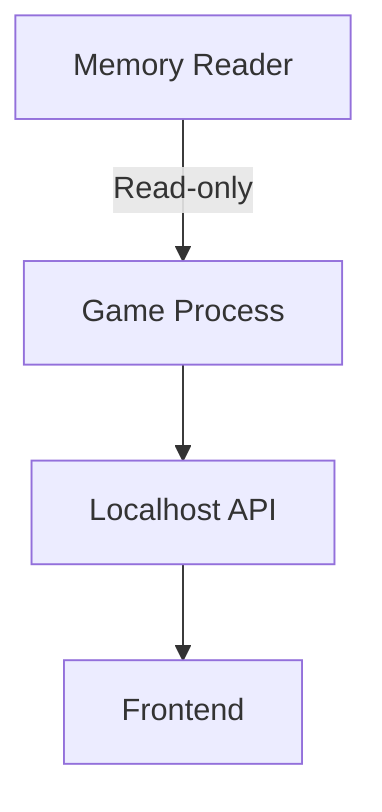

# Technical Analysis Documentation

## Memory Analysis Approach
```cpp
// Example memory reading workflow
1. Attach to process using OpenProcess()
2. Locate base address of target module
3. Scan for patterns using AOB scanning
4. Read structured data from memory
```

## Data Flow


## Key Components

### MemoryReader
- Process attachment via `PROCESS_VM_READ`
- Pattern scanning with wildcard support
- Safe memory reading operations

### Backend API
| Endpoint | Method | Description |
|----------|--------|-------------|
| `/api/entities` | GET | Retrieve all entities |
| `/api/update` | POST | Push new entity data |

### Dashboard Features
- Real-time 3D scatter plot
- Entity filtering system
- Historical data tracking

## Performance Considerations
- Memory scanning interval: 1000ms
- Maximum batch size: 1000 entities
- WebSocket update throttling: 200ms

## Security Model

